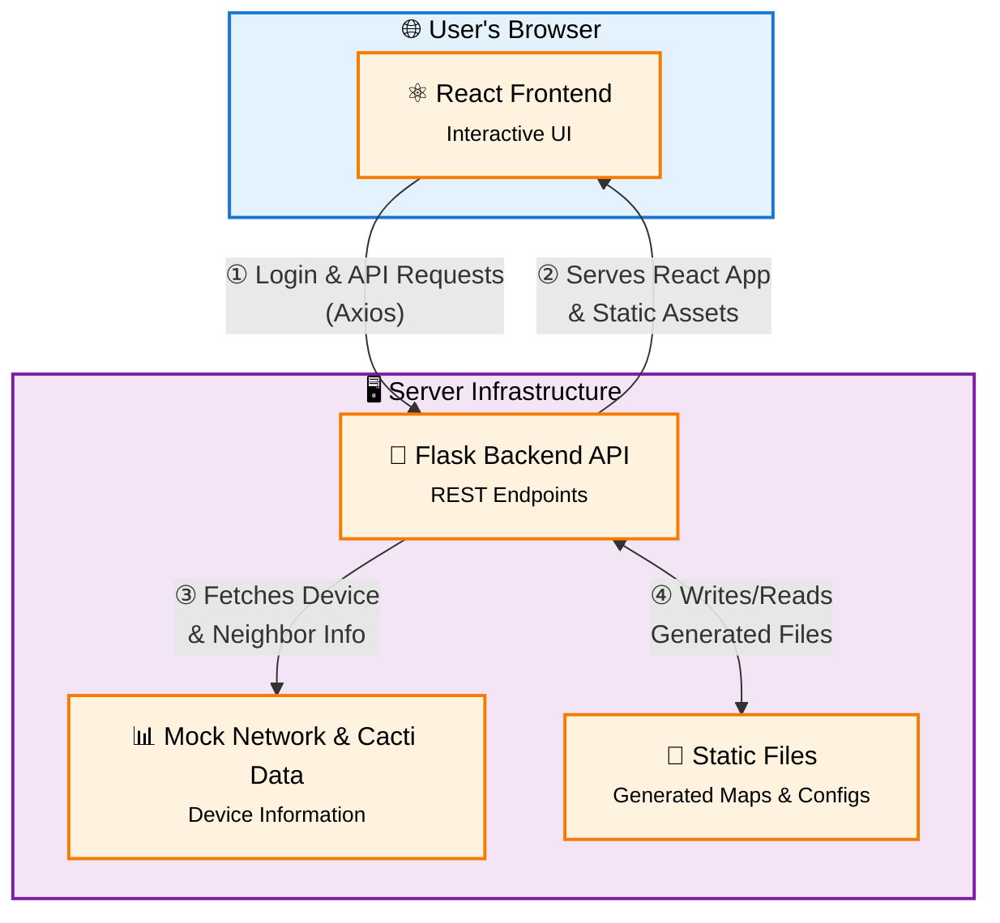

# AutoCacti Map Creator

  
  
  
  

**AutoCacti Map Creator** is a powerful and intuitive web application that streamlines the process of creating network topology maps for Cacti Weathermap. Move beyond manual configuration files and embrace a modern, visual, drag-and-drop interface to design, arrange, and export your network diagrams effortlessly.

## ✨ Key Features

-   **Interactive Map Editor**: Build your network diagram visually using a drag-and-drop interface powered by React Flow.
-   **Automated Device Discovery**: Start with a single device IP and automatically discover its neighbors via SNMP (mocked).
-   **Dynamic Node Creation**: Add devices, end-points, and descriptive text nodes to the map.
-  	**Grouping & Layering**: Organize your map with customizable groups, shapes, and z-index layering.
-  	**Alignment & Distribution Tools**: Precisibly align and distribute nodes for a clean and professional look.
-  	**Backend Processing**: A robust Flask backend handles map generation, image processing, and task management.
-  	**Automated Cacti Config Generation**: The application automatically generates the Weathermap `.conf` file based on your visual layout.
-  	**Multi-Tenancy Support**: Upload a single map design to multiple Cacti installation groups simultaneously.
-  	**Theming & Localization**: Supports both Light and Dark modes, with multi-language support (EN/HE).
-  	**Authentication**: Secure JWT-based authentication for protecting access.

## 🏗️ Architecture Overview

The application follows a modern client-server architecture, with a distinct separation between the frontend and backend.

-  	**Frontend**: A Single Page Application (SPA) built with **React**. It is responsible for all user interactions, rendering the map canvas, and managing the visual state of the network diagram.
-  	**Backend**: A **Python Flask** API that serves as the brain of the operation. It handles authentication, simulates network data retrieval, processes the map data submitted by the frontend, and generates the final Cacti-compatible assets.

### System Architecture Diagram

